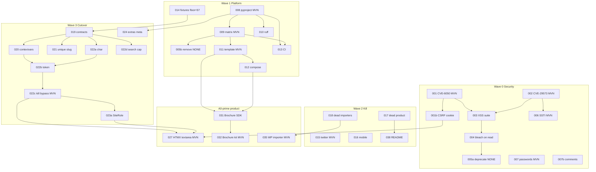
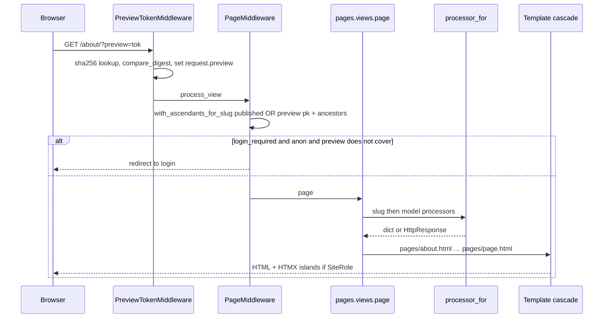
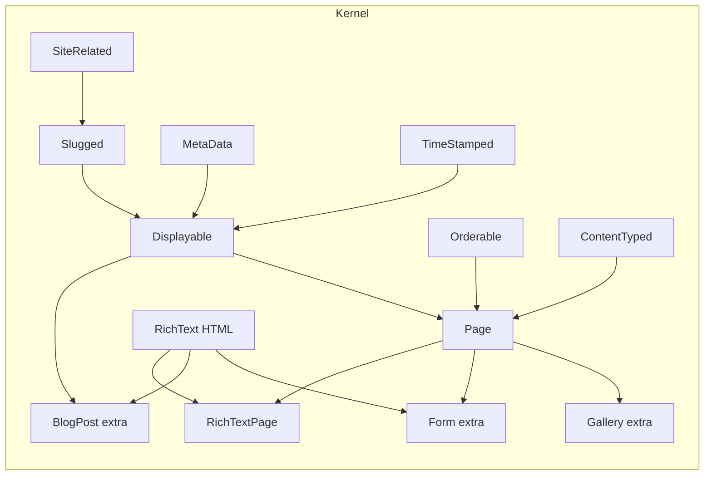

# Nova — Extract Mezzanine into a Modern Publishing Kernel

| Field | Value |
|---|---|
| **Document** | Nova design (working title) |
| **Author** | TBD |
| **Date** | 2026-08-11 |
| **Revised** | 2026-08-11 (review: A0′ cut; user decisions: `nova-cms`, comments off, TinyMCE 4 stays in admin) |
| **Status** | Approved (A0′) |
| **Repo** | `/Users/prondubuisi/gitrepos/dev/mezzanine` (fork of `prondubuisi/mezzanine`, identical to `stephenmcd/mezzanine@85dfd412`) |
| **Tree version** | `mezzanine.__version__ = "9999dev0"` |
| **Council** | `docs/modernization/council/` — 17 generals + 7 voters. Binding: `CONSENSUS.md` |
| **Audience** | Senior engineers who know this tree |
| **Staffing (A0′)** | **2 engineers × 6 months.** Full Nova is the north star, not the year-1 commit. |

This document is an implementation contract, not a vision deck. File paths, function names, and PR boundaries are real. Council motions marked **binding** are not reopened here.

**Approved plan is the full A0′ year.** Do not shrink further. A0′ = Waves 0–3 + Brochure kit + adult WP importer + HTMX `` with a sanitized textarea. Full Nova (document JSON, Media-as-Displayable, Magazine/Institute kits, schema-as-code API, AI Proposal scaffold, TinyMCE 7 extra, mandatory 2FA, Postgres FTS) remains the north star the release train walks toward. An engineer starting tomorrow implements A0′.

---

## Overview

Mezzanine is a coherent Django CMS kernel wrapped in a 2012 product. The kernel is still the right grain: `SiteRelated` → `Slugged` → `Displayable`; `Page = Displayable + Orderable + ContentTyped`; page processors; hostname multi-site; ``. Everything around it is a museum: TinyMCE 4.1.10, Bootstrap 3.2.0, `grappelli_safe`, two unpatched XSS CVEs plus adjacent IDOR/SSTI, `import imp` in the project template, `django < 6`, staff-sees-all-drafts, and a search engine that materializes every row in Python.

**Nova** is a new product that extracts that kernel, reboots the platform to 2026 defaults, and ships as *the Django site you install on Friday* — for Python shops replacing one marketing WordPress box. It is not Mezzanine 7, not a Grappelli restyle, not a Wagtail clone, and not a WordPress-killer. WordPress is a gravity well. We win on typed models, default security, batteries without plugin hell, and a Python-native AI plane later.

**“Extract” in Y1 does not mean a new directory or a new distribution.** It means: freeze kernel contracts with tests, declare blog/forms/galleries/accounts as extras, delete twitter/mobile/dead product, stop importing Page from those apps. No `mezzanine/kernel/` move. Import path stays `mezzanine.*` (KD1).

**Year 1 (A0′) ships:** CVE/SSTI/password fixes, a hardened `nova-project` template on Django 5.2 / 6.x and Python 3.12+, the kill list, draft-default + opaque preview tokens, per-(user, site) roles used by `/edit/` and preview-issue, HTMX `` (textarea), one Brochure kit, an adult WP importer. **Year 1 does not ship:** JSON `body`, Media-as-Displayable, Magazine/Institute kits, OpenAPI generator, AI models, TinyMCE 7, a visual canvas, Editorial Desk, commerce, a plugin marketplace, campus federation, or mandatory 2FA as a kernel gate.

---

## Background & Motivation

### What the code actually is

Verified against this tree, not the README:

| Claim | Reality |
|---|---|
| Mixin kernel | `SiteRelated` → `Slugged` → `Displayable = Slugged + MetaData + TimeStamped` in `mezzanine/core/models.py`. `Page = BasePage(Orderable, Displayable) + ContentTyped` in `mezzanine/pages/models.py`. |
| Blog is not a Page | `BlogPost(Displayable, Ownable, RichText)` in `mezzanine/blog/models.py`. Forms and Galleries *are* Pages. |
| Content types | MTI via `content_model` CharField + `get_content_model()`. One-level subclassing only (`docs/content-architecture.rst:162-170`). |
| Multi-tenancy | Hostname → `current_site_id()` in `mezzanine/utils/sites.py`, stored on `threading.local` via `CurrentRequestMiddleware` (`mezzanine/core/request.py`). Media is shared. |
| Publishing | `CONTENT_STATUS_DRAFT=1` / `PUBLISHED=2`. Default is **Published**. `PublishedManager.published()` returns `self.all()` for any `is_staff` (`core/managers.py:64-65`). No tokens. |
| Search | `SearchableQuerySet.search` builds `__icontains` Qs; `annotate_scores()` materializes all rows and `str.count`s in Python (`core/managers.py:217-254`). |
| Sanitization | `RichTextField.clean` → `utils.html.escape` → bleach **on form save only**. Render path is `|richtext_filters` → thumbnails → `mark_safe`. `RICHTEXT_FILTER_LEVEL_NONE` is admin-editable. |
| Editor | TinyMCE **4.1.10 (2015-05-05)** vendored at `mezzanine/core/static/mezzanine/tinymce/`. Inline edit is jQuery Tools overlay + `jquery.form` + full reload. `core.views.edit` is POST-only, `@staff_member_required`, returns `""` or the first error string (`core/views.py:69-89`). |
| Bootstrap | **3.2.0** at `mezzanine/core/static/css/bootstrap.css`. |
| Packaging | `pyproject.toml` is exactly 14 lines of `[tool.black]`. Real metadata is `setup.cfg`: `django >= 2.2, <6`, `python_requires >= 3.8`, classifiers **3.8–3.14 and Django 2.2–5.2**, `universal = 1`. |
| Bootstrap command | `mezzanine/bin/management/commands/mezzanine_project.py` does `from distutils.dir_util import copy_tree`. Template `settings.py:307` does `import imp`. Both die on Python 3.12+. |
| Tests | `pytest.ini` `--cov-fail-under 57`. `mezzanine.utils.tests.TestCase` creates a superuser named `test`/`test`. `test_draft` asserts staff GET → 200 (`tests/test_core.py:121-131`). `test_nested_override_site_id` **asserts** `RecursionError` (`tests/test_core.py:604-612`). |
| Importers | **Six** commands: `import_wordpress`, `import_rss`, `import_blogger`, `import_posterous`, `import_tumblr`, `import_blogml`. Zero tests. |
| Security holes in Wave 0 scope | See table below. |

### Wave 0 attack surface (this tree)

| Finding | Severity | Location |
|---|---|---|
| **CVE-2025-6050** — JSON served as `text/html`, no `admin_view` | High | `core/views.py:161-186` (`HttpResponse(dumps(...))`); mounted raw in `boot/lazy_admin.py:112-116` |
| **CVE-2025-29573** — stored XSS via form-upload filename | High | `forms/forms.py:430-435` (`mark_safe` on `split(value)[1]`) |
| **`file_view` IDOR** — no site join | High | `forms/admin.py:188-198` (`get_object_or_404(FieldEntry, id=...)`) |
| **SSTI** — form field `default` rendered as a Django template with full `RequestContext` | High | `forms/forms.py:175`; context built in `forms/page_processors.py:28-29` |
| **CVE-2025-50481 class** — save-only optional bleach | Medium | `core/fields.py:50-54`; `mezzanine_tags.py:479-503`; `RICHTEXT_FILTER_LEVEL` `editable=True` includes NONE (`core/defaults.py:468-500`) |
| Password-reset link logs the user in | High | `accounts/views.py:184-188` |
| Min password 6 | High | `accounts/defaults.py:37-41` |
| Drafts visible to any `is_staff` by URL | Medium | `core/managers.py:64-65` (Wave 3, not Wave 0) |

### Pain this change addresses

1. **The fork cannot be installed on current Python/Django.** Classifiers claim 3.8–3.14 *and* Django 2.2–5.2; `django < 6` blocks 6.x; `imp`/`distutils` break 3.12+ generated projects. Docs still teach 3.7–3.10 / 2.2–4.0.
2. **Two public XSS CVEs plus IDOR and SSTI are unpatched.** The XSS suite is one `escape("<foo><div>")` assertion.
3. **The product identity is 2012 marketing** (Twitter — including committed OAuth secrets at `twitter/models.py:76-83` — bit.ly, Disqus, UA, Jython, Freenode, Cartridge, “Free Themes Marketplace”) sitting on a kernel that is still the best thing in the repo.
4. **Authoring is a queryset exception**, not a preview product. Default-published + staff-sees-all-drafts is how marketing sites leak.
5. **There is no honest way to replace a WordPress marketing box on Friday.** `mezzanine-project` is broken, the template is insecure, and the first-run experience is “debug a 2014 Bootstrap theme.”

### Why extract rather than evolve or rewrite

Council architect (`01-architect.md`) and skeptic (`14-skeptic.md`) agree on the mechanism and disagree on the ambition. Binding vote **M1 = C (7/7)**: new product, extract kernel, rebrand. Evolve-in-place produces a Frankenstein. A greenfield rewrite re-litigates the Page/Displayable split and the processor contract.

“Beat WordPress” is a **category error as a market claim** (skeptic, unanimous refusal). It is a **valid product ambition** on dimensions we can win: typed content, default security, batteries without 69k plugins, Friday-install for people who already write Django.

The first draft of this document kept M1=C and then re-attached most of the product-general’s year (`13-product.md`). That is not a 2-person year. **A0′ is M1=C sized for the team we have.** Full Nova is what A0′ walks toward.

---

## Goals & Non-Goals

### Cut line (read this before the lists)

| Horizon | What ships | Staffing |
|---|---|---|
| **A0′ / Y1 (default)** | Waves 0–3 + Brochure + WP importer + HTMX textarea editable | 2 eng × 6 mo |
| **Y1.5** | JSON `body` (html-only schema), Media-as-Displayable, TinyMCE 4 deleted / TinyMCE 7 extra, page-tree JS, Grappelli optional, Magazine token preset, private `/_nova/api/`, Postgres FTS, optional 2FA extra, CSP hardening beyond template defaults | 2 eng × +4 mo |
| **Y2 north star** | Institute kit, AI Proposal product, Revisable snapshots, Taxonomy kernel, catalog+Stripe, vector plane | new motion |

### Year-1 goals (A0′)

1. **Kernel contracts frozen.** `Displayable` / `Page` / processors / settings / search *interface* / bleach pipeline tested. No package rename, no directory extract.
2. **Platform reboot.** `pyproject.toml` + `uv` + Ruff + Django 5.2 floor / 6.x tested. Drop Python ≤3.11 and Django < 5.2. Trusted Publishing. Working `nova-project` (no `imp`/`distutils`). `asgi.py`. `compose` + `just`.
3. **Friday install of one Brochure site.** `uvx nova-project mysite --kit brochure` then `just bootstrap`.
4. **Editor we can staff.** Vanilla-enough Django admin (Grappelli may still be installed in Y1). Rewrite `` as HTMX + textarea. Admin is a superuser escape hatch. No Desk, no canvas.
5. **Draft-by-default + opaque preview tokens.** Staff-sees-all-drafts-by-URL dies.
6. **Security that a junior pen-test would not laugh at.** Both CVEs, `file_view` IDOR, SSTI, bleach-on-read (non-raising in Wave 0), password 12 + reset-does-not-login, comments default-off, `createdb` refuses `admin`/`default` when `DEBUG=False`, SecurityMiddleware + CSP nonce in the template, per-(user, site) role used by `/edit/` and preview-issue. **Not** mandatory 2FA as a kernel gate.
7. **One official kit: Brochure.** Unsigned `kit.json` metadata. M7 still forbids a marketplace.
8. **Adult WP importer** (permalinks, Yoast meta, redirect table, HTML stays HTML). Attachments stay `FileField` until Media exists.

### Explicitly not Y1 (north star, scheduled)

| Item | When | Why deferred |
|---|---|---|
| JSON `RichText.body` | Y1.5 | Abstract mixin; needs per-app migrations; editor cannot produce blocks |
| Media-as-Displayable | Y1.5 | Sitemap/url_map/slug side effects undesigned for Y1 |
| Magazine kit / Institute types | Y1.5 / Y2 | Institute is the higher-ed wedge (M2 forbids). Magazine = `[blog]` + tokens |
| Schema-as-code API | Y1.5 | Second surface; `displayable_links_js` just needs JSON + authz |
| AI Proposal scaffold | Y2 | Flag-off models are still a product to staff |
| TinyMCE 7 extra / delete TinyMCE 4 tree | Y1.5 | HTMX island is a textarea; 4.x stays in admin until then |
| Postgres `SearchVector` | Y1.5 | Y1 only caps `annotate_scores` |
| Mandatory staff 2FA | Y1.5 extra, off in pytest | Not a Wave 3 kernel gate |
| Signed ed25519 kits | Y2 | Operator already has filesystem write; M7 ≠ crypto |
| Metrics / `healthz` | Y1.5 | Not an A0′ success metric |

### Non-goals (any year unless a new motion)

| Non-goal | Why | Binding |
|---|---|---|
| Out-distribute WordPress | Category error | Unanimous refusal |
| Open plugin marketplace | Recreates plugin hell | **M7 = B (7/7)** |
| Gutenberg / Sanity / Wagtail canvas | Cannot staff a JS editor platform | **M3 = A** + M3/M8 synthesis |
| Full Editorial Desk | After types + tokens | M3/M8 synthesis |
| Commerce engine / Cartridge | First **Y2** module | **M6 = A (4–3)** |
| Campus federation as Y1 ICP | Tenancy/2FA/audit incomplete | **M2 = D (7/7)** |
| Headless-first rewrite | Projection later, not a second CMS | Architect 6.5 |
| StreamField-as-JSON-only-truth | — | Prompt + `11-python-cms.md` |
| twitter / mobile / bit.ly / Disqus / UA / Jython / Freenode as product | Dead | Unanimous + `08-legacy.md` |
| In-place “Mezzanine 7 beats WordPress” | Extract + rebrand | **M1 = C (7/7)** |
| Public product name | Working title **Nova** | **M5 = D (7/7)** |

### Success metrics (passable after Wave 3 + Brochure, not after an AI PR)

- `uvx nova-project mysite --kit brochure && just bootstrap` boots on Python 3.12+ / Django 5.2 or 6.1 with `DEBUG=False` defaults: both CVE shapes gone, SSTI gone, drafts not URL-guessable without a token, min password 12, SecurityMiddleware on, comments not auto-approved.
- Time-to-first-published-page for a developer who already knows Django: **< 60 minutes**, including WXR import of a 50-page marketing site, with ≥95% of public permalinks redirected.
- Kernel contract tests cover `published()` (no staff bypass), `current_site_id` pipeline, processor contract, slug-path invariant, and two-site isolation for pages and form files.
- Zero references to twitter/mobile/bit.ly/Disqus/UA/Jython/Freenode in the README feature list.

We do **not** measure “sites stolen from wordpress.org.” We do **not** require 2FA, OpenAPI, or an AI accept-rate to call Y1 done.

### If we only ship 12 PRs (minimum valuable Nova)

In this order: **001, 002, 006, 007, 008, 009, 011, 015, 022c, 027, 032, 035**. That is still Nova (new product, one kit, Friday install, drafts are drafts). Everything else in the train can die and those twelve remain valuable.

---

## Key Decisions

Each decision is binding unless marked *provisional*. Rationale cites council and code.

### KD1 — New product, extract kernel, rebrand (working title Nova)

**Decision.** Ship a new product. Extract the Mezzanine kernel. Do not hospice-only. Do not library-only. Do not “Mezzanine 7.” Public name deferred; README lead sentence is “Nova is a publishing kernel descended from Mezzanine.”

**Y1 extract =** frozen contracts + extras metadata + deleted apps. **No directory move.** The word “extract” means “stop depending on twitter/blog/forms to import `Page`.” An engineer must not start a `mezzanine/kernel/` package shuffle.

**Import path (Y1).** Keep `mezzanine.*`.

**Distribution / PyPI name: `nova-cms`.** New package that re-exports `mezzanine.*` so we never collide with `stephenmcd/mezzanine` on PyPI. Operators install `nova-cms` and continue to `import mezzanine`. Product display name stays the working title Nova; M5 still defers the public brand. `pyproject.toml` `[project].name = "nova-cms"`. Console script `nova-project` is an entry point of `nova-cms`. A deprecated `mezzanine-project` alias may remain for one minor.

### KD2 — Year-1 ICP is one marketing WordPress box at a Django shop

**Decision.** Buyer: a Python/Django shop replacing **one** marketing/brochure WordPress site. Champion: the Django engineer. Daily user: a marketing manager. Anti-persona: hobby freelancer as buyer, $4 Woo store, campus federation, JS-headless team.

**Rationale.** M2 = D (7/7). M4 = B: wedge is **site kits + Friday install**. One kit (Brochure) is enough to prove the wedge.

### KD3 — Y1 editor is Django admin + HTMX `` (textarea)

**Decision.** Keep Django admin. Rewrite `` / `endeditable` as HTMX fragments against a **sanitized textarea**. No yellow modal, no full reload, no TinyMCE inside the island. Admin remains the place you publish, manage the tree, and edit long HTML — **and it keeps TinyMCE 4 until Y1.5** (PR-028). On-site `` is never TinyMCE. Declare admin a superuser escape hatch *in copy and IA*; do not replace it. No Desk, no canvas.

**Protocol is in §7.** `POST /edit/` stays POST (not PATCH).

### KD4 — No commerce engine in Y1. Cartridge is dead.

Unchanged. M6 = A.

### KD5 — Curated kits/types only. Never an open marketplace. No signatures in Y1.

**Decision.** Extension is: subclass `Page`/`Displayable`, drop `page_processors.py`, install a **reviewed** kit app. No admin “install plugin.” `EXTRA_MODEL_FIELDS` gets a system check **warning** in Wave 1 (error in Y2).

**Y1 kits are unsigned.** `kit.json` is metadata (name, version, nova_compat, types). `NOVA_ALLOW_UNSIGNED_KITS` is not needed because unsigned is the only mode. M7 is a *marketplace* refusal, not an ed25519 requirement. Signatures are Y2 if we ever distribute kits beyond this repo.

### KD6 — Keep the mixin kernel and the Page/Displayable split. Replace the dead ends.

Unchanged keep-list. Y1 *replace* list is smaller: staff-sees-all-drafts, thread-local request bus, default-Published, `RICHTEXT_FILTER_LEVEL` as an admin kill-switch. HTML-blob-as-body, icontains engine, filebrowser-as-truth stay in Y1 and are replaced in Y1.5.

### KD7 — Document body stays HTML in Y1. JSON is Y1.5 north star.

**Decision.** Y1 does **not** add `RichText.body`. `content` remains an HTML `RichTextField`. Bleach on write and read. When Y1.5 adds a document column, the v1 schema is **only** `{blocks:[{type:"html", html}]}`. figure/pullquote/embed/query wait until an island can edit them. Relational `PageSection` is a kit-level pattern, not a kernel model, until Institute exists.

`RichText` is abstract (`core/models.py:404-415`). A future `body` column **cannot** migrate via `core/migrations/` alone. Concrete in-tree subclasses: `pages.RichTextPage`, `blog.BlogPost`, `forms.Form`, `galleries.Gallery`. Out-of-tree subclasses need a system check. Versions, when we do it: N = wrap + read-body-or-content; N+1 = `content` always generated from `body`.

### KD8 — Preview is an opaque DB token. Draft is the default. Staff-by-URL dies.

**Decision.** `Displayable.status` default becomes `CONTENT_STATUS_DRAFT`. `PublishedManager.published(for_user=)` **no longer** short-circuits on `is_staff`. Preview is a **database capability**, not a signed blob:

- `token = secrets.token_urlsafe(32)` stored as `sha256(token)` (unique, indexed). Presentation compares with `hmac.compare_digest`.
- No HMAC-of-pk, no `SECRET_KEY`-signed JWT, no `rev` field (Revisable is Y1.5+, OQ6).
- Multi-hit until `expires_at`. Revoke = delete the row.
- URL: `?preview=<token>`. Header `Preview-Token` accepted on `/_nova/` later; Y1 is query-string only.
- Mismatch, expiry, unknown token, site mismatch: **404** (not 403 — do not confirm existence).
- `as_role=anon`: any holder sees that object, rendered without edit chrome.
- `as_role=staff`: requester must be authenticated staff with a `SiteRole` on that site; else 404.
- Token for an already-Published object: 200, harmless.
- Responses: `Cache-Control: private, no-store`. Bypass `UpdateCacheMiddleware` the same way `nevercache` does. **Test required** (see PR-022b).

KD8 previously said “HMAC token (object + rev + …)”. That sentence is withdrawn.

### KD9 — Sanitize on write AND read. Kill the admin kill-switch (in two steps).

**Decision.**

- **Wave 0:** append `mezzanine.utils.html.escape` as the last default `RICHTEXT_FILTERS` entry. Custom filters that return non-`SafeText` still `FutureWarning` (do **not** raise — operators on this tree have custom filters). Deprecate `RICHTEXT_FILTER_LEVEL_NONE` with a system check warning if it is set.
- **Wave 1 (with the Django floor):** `RICHTEXT_FILTER_LEVEL` is not admin-editable. NONE only via env `NOVA_FORCE_RAW_HTML=1`. Non-`SafeText` **raises**.

One raw-HTML control. No `html.publish` capability. No LOW-vs-NONE-vs-env triangle. LOW (iframe/embed) is `NOVA_RICHTEXT_LEVEL=low` in env if anyone needs it; default is HIGH.

### KD10 — Per-(user, site) roles. Not a CharField on today’s `SitePermission`.

**Decision.** Today `SitePermission` is `OneToOne(User)` + M2M `sites` (`core/models.py:607-624`). A single `role` column cannot be per-site.

Replace with:

```python
class SiteRole(models.Model):  # may keep the name SitePermission
    user = models.ForeignKey(settings.AUTH_USER_MODEL, on_delete=models.CASCADE)
    site = models.ForeignKey("sites.Site", on_delete=models.CASCADE)
    role = models.CharField(max_length=16, choices=[
        ("author", "Author"),
        ("editor", "Editor"),
        ("publisher", "Publisher"),
        ("admin", "Admin"),
    ])
    class Meta:
        constraints = [
            models.UniqueConstraint(fields=["user", "site"], name="nova_siterole_user_site"),
        ]
```

Migration: for each existing `SitePermission`, for each M2M site, insert `(user, site, role="editor")`. Superuser remains cross-site break-glass and does not need rows.

Y1 enforcement surface is **narrow**: `/edit/` and preview-token issue. Django admin keeps Django model perms + “has a `SiteRole` for `current_site_id()`” (today’s `has_site_permission`). We do not wrap every `ModelAdmin.has_change_permission` in Wave 3.

### KD11 — Media-as-Displayable is Y1.5

**Decision.** Y1 does not add `Media(Displayable)`. filebrowser_safe may remain installed. Galleries keep `GalleryImage.FileField`. WP importer writes attachments to those fields.

Y1.5 recommendation (not implemented now): `Media(SiteRelated)` first; promote to `Displayable` only when the asset is a public page. If it must be Displayable: `in_sitemap=False` default, exclude from `SEARCH_MODEL_CHOICES`, `get_absolute_url` under `/_nova/media/<pk>/` (not the storage path). Zip-bomb limits belong in the galleries extra, not the Media PR.

### KD12 — Theme SDK is tokens + Django templates. Y1 official kit = Brochure only.

**Decision.** One CLI: **`uvx nova-project mysite --kit brochure`** writes a compose/just project with Brochure templates and fixtures. **`just bootstrap` does not take `--kit`.** `just new brochure` is not a command.

Magazine = `[blog]` extra + a token CSS preset, not a second theme, in Y1.5. Institute = Y2.

Zero React on the public site. Public pages load **no jQuery** unless a staff session is present.

### KD13 — Schema-as-code API is Y1.5

**Decision.** Y1 fixes `displayable_links_js` (JSON + authz). The OpenAPI generator and `/_nova/api/` wait. First Y1.5 consumer is still the link picker and `resolve`.

### KD14 — AI is Y2. Cite-or-don’t and Proposal-gated remain the law when we build it.

**Decision.** No `mezzanine.ai` package in Y1. The architecture in `12-ai-native.md` is the north-star constraint, not a Wave 5 PR.

### KD15 — WP importer is kept and made adult. Other importers die.

**Decision.** Keep `import_wordpress` + `import_rss`. Delete `import_posterous` and `import_blogger`. Tumblr/BlogML: delete in the same PR (six commands, not seven). Adult WP: permalinks → `Redirect`, Yoast `_yoast_wpseo_title` / `_metadesc` → `MetaData`, parent pages → tree, HTML left as HTML (no wrap-to-JSON), a `MigrationReport` JSON printed by the command.

### KD16 — Site context moves from `threading.local` to contextvars. Pipeline stays.

Unchanged. PR-020 **must flip** `tests/test_core.py::test_nested_override_site_id` (it currently asserts `RecursionError`).

### KD17 — Search: Y1 caps materialization. Engine replacement is Y1.5.

**Decision.** Keep `search_fields`, `objects.search(query, for_user=)`, `SEARCH_MODEL_CHOICES`. Y1 adds `SEARCH_MAX_RESULTS` (default 200) so `annotate_scores()` and the Python union (`core/managers.py:380-388`) cannot materialize unbounded rows. Postgres `SearchVector`/`SearchRank` on title + content + `keywords_string` is Y1.5 (and does not depend on a `content_text` column — it can rank `content` with `strip_tags` or a generated column later).

### KD18 — Grappelli/Filebrowser stay installable in Y1. Identity change is Y1.5.

**Decision.** Hard-require can drop when we have a Media chooser (Y1.5). Y1 template may still list them in `OPTIONAL_APPS`. New code does not add `__grappelli_installed` branches.

### KD19 — 2FA is an optional extra, off in pytest, not a Wave 3 gate

**Decision.** `NOVA_STAFF_2FA=1` in the hardened template is allowed in Y1.5. A0′ does not require TOTP to log into admin. `createdb` / `just bootstrap` / `createsuperuser` stay password-only in Y1.

---

## Proposed Design

### 1. Product shape (A0′)

```
                   ┌─────────────────────────────────────────┐
                   │  Nova (product, working title)          │
                   │  "descended from Mezzanine"             │
                   └─────────────────────────────────────────┘
                                      │
          ┌───────────────────────────┼───────────────────────────┐
          ▼                           ▼                           ▼
   kernel (same tree,                Brochure kit                extras
   mezzanine.* imports)              (in-repo, unsigned)         (same repo)
   · core / pages / conf             · tokens.css                · blog
   · utils / boot                    · templates/                · forms
   · generic.fields                  · fixtures/demo.json        · galleries
   · project_template                · kit.json (metadata)       · accounts
   · migrate (WP + RSS)                                          · (ai = Y2)
```

**Friday CLI (one):**

```bash
uvx nova-project mysite --kit brochure
cd mysite
just bootstrap   # compose up db/redis, migrate, createsuperuser
just import-wp ./export.xml
just up
```

`just bootstrap` never takes `--kit`. The kit was chosen when the project was written.

### 2. Kernel extract (contract freeze, not a move)

#### 2.1 Stays importable as `mezzanine.*`

Same module list as before (`core`, `pages`, `conf`, `utils`, `boot`, `generic.fields`, `template`). PR-024 only adds `[project.optional-dependencies]` extras. Code does not move.

#### 2.2 Optional extras (packaging metadata)

`[blog]`, `[forms]`, `[galleries]`, `[accounts]`, `[migrate]`. Brochure template installs forms. Full template (non-Brochure) may still install blog+forms+galleries as today.

#### 2.3 Deleted (not deprecated)

| Path | Why |
|---|---|
| `mezzanine/twitter/` | Deprecated since 5.0, API 1.1, **committed OAuth secrets** (`twitter/models.py:76-83`). Treat those keys as **burned**. We will **not** `git filter-repo` the fork in Y1 (rewrites every SHA and every downstream). Document the exposure. |
| `mezzanine/mobile/` | Two files and a `FutureWarning` |
| `TemplateForDeviceMiddleware` | Stub |
| `Displayable.generate_short_url` bit.ly call | Keep `short_url` nullable; no network |
| UA snippet | `analytics.js` sunset 2023 |
| Disqus as first-class settings/templates | Out of default product |
| `import_posterous.py`, `import_blogger.py`, `import_tumblr.py`, `import_blogml.py` | Dead or untested fossils. Six commands exist; four go. |
| README claims | Jython, Freenode, Mercurial/Bitbucket, Cartridge, Marketplace, Facebook/Twitter sharing |

`BlogPostAdmin` drops `TweetableAdminMixin` with twitter.

TinyMCE 4 tree, Chosen, jQuery Tools: **not deleted in Y1** (HTMX island does not load them; admin still might). Deletion is Y1.5 PR-028.

#### 2.4 Kernel contract tests (`tests/test_kernel_contracts.py`)

1. `Displayable.get_absolute_url` still raises `NotImplementedError` on the abstract.
2. `Page.get_slug` is parent-prefixed; `set_slug` rewrites descendants; `set_parent` cycle-checks. **Do not** suffix-rewrite `Link` slugs that start with `http`.
3. `UniqueConstraint(fields=["site", "slug"])` on `pages.Page` and `blog.BlogPost` (application-level uniqueness today is per `base_concrete_model(Slugged)` — all Page MTI children share the Page namespace; the constraint is on `pages_page`, not `pages_richtextpage`).
4. `processor_for(Model)` and `processor_for("some/slug")` still merge dicts / short-circuit on `HttpResponse`.
5. `PageMiddleware` still attaches the deepest prefix page.
6. `published()` instance method ignores staff; the manager does not short-circuit on `is_staff`; a valid token unions `pk=token.object_pk`.
7. Two-site isolation: staff A on site 1 cannot `get` site 2’s page or form file by pk.
8. `current_site_id` resolution order; nested `override_current_site_id` works (this **changes** `test_nested_override_site_id`).
9. `|richtext_filters` default pipeline bleaches; `<script>` does not survive render.
10. `url_map()` excludes drafts without a token. (Media is not in `url_map` in Y1.)

### 3. Platform reboot

Unchanged in spirit (PEP 621, hatchling, `[project].name = "nova-cms"`, `requires-python >= 3.12`, `django>=5.2,<6.2`, Ruff, living tox cells, Trusted Publishing, `STORAGES`, delete Django 1.9/1.10 shims). Install: `uv add nova-cms`. Import: `import mezzanine`.

Drop `pytz` when we touch `utils/timezone.py`. Drop `requests-oauthlib` with twitter. `grappelli_safe` / `filebrowser_safe` remain dependencies in Y1.

**Coverage floor stays 57** until a wave gate where new tests already exist: 60 after Wave 0 (XSS + accounts + forms tests), 65 after Wave 3 (contracts + preview + tenancy). PR-014 does not raise the floor.

**MySQL is unsupported.** Production default is Postgres. `slug` is `max_length=2000`; a unique btree on that column is fine on Postgres and SQLite, not on MySQL utf8mb4. Document it. No hash-column workaround in Y1.

### 3.4 Project template (Wave 1, PR-011)

`mezzanine/project_template/` becomes a 2026 artifact in **one** PR so the Friday path exists:

- `asgi.py` next to `wsgi.py`.
- `SecurityMiddleware` first. Secure cookie flags when `DEBUG=False`.
- `ContentSecurityPolicyMiddleware` (nonce) — **this is on PR-011**, not a phantom goal.
- `AUTH_PASSWORD_VALIDATORS`: length 12, common-password, attribute similarity.
- No `exec(open(local_settings.py))`. No `import imp`. `importlib` or `from .local_settings import *`.
- `createdb` refuses `DEFAULT_USERNAME`/`DEFAULT_PASSWORD` (`admin`/`default` in `core/management/commands/createdb.py:12-14`) when `DEBUG=False`.
- Generate a 50-char `NEVERCACHE_KEY`; refuse empty key if cache middleware is on.
- Delete deprecated `SSLRedirectMiddleware` (HTTPS→HTTP downgrade oracle).
- `EXTRA_MODEL_FIELDS` system check **warning**.
- `shutil.copytree` in `mezzanine_project.py`.

### 4. Publishing, drafts, preview tokens

#### 4.1 State machine (Y1)

```
        create
          │
          ▼
       Draft ────────── ?preview=<opaque token>
          │
          │  capability: *.publish  (admin action; publisher+)
          ▼
      Published ──── future publish_date → hidden until then
          │              (admin label: Scheduled)
          │  expiry_date or unpublish
          ▼
       Draft
```

No pending-review workflow.

#### 4.2 `published()` — split across three merges (see PR-022a/b/c)

Today (`core/managers.py:56-70`):

```python
if for_user is not None and for_user.is_staff:
    return self.all()
```

Target (after 022c):

```python
def published(self, for_user=None, preview=None):
    qs = self.filter(
        Q(publish_date__lte=now()) | Q(publish_date__isnull=True),
        Q(expiry_date__gte=now()) | Q(expiry_date__isnull=True),
        status=CONTENT_STATUS_PUBLISHED,
    )
    if preview is not None and preview.covers(self.model):
        return self.filter(pk=preview.object_pk) | qs
    return qs
```

`for_user` remains on the signature because `PageManager.published` uses it for `login_required`, and callers already pass it. It no longer means “staff see drafts.”

`PageManager.published` (`pages/managers.py:8-29`) still excludes `login_required=True` for unauthenticated users unless `include_login_required=True`. **Preview exception:** if `preview` covers that page, do not exclude it (client preview of a members page).

#### 4.3 `with_ascendants_for_slug` after the bypass dies

`pages/managers.py:68` does `self.published(**kwargs)`. After 022c, a staff member previewing `/about/team/` whose `/about/` parent is also draft would lose the chain.

**Contract:** if `preview` covers a `Page`, union that page **and load ancestors with `Page._base_manager.filter(site_id=..., pk__in=parent_walk)`** (site-scoped, ignores publish). Ancestors are for template cascade / breadcrumbs only. **`page_menu` does not take a preview** and must not list draft siblings (`pages/templatetags/pages_tags.py:52`).

#### 4.4 Token model

```python
class PreviewToken(models.Model):
    token_hash = models.CharField(max_length=64, unique=True)  # sha256 hex
    content_type = models.ForeignKey(ContentType, on_delete=models.CASCADE)
    object_pk = models.TextField()
    site = models.ForeignKey("sites.Site", on_delete=models.CASCADE)
    as_role = models.CharField(max_length=8, choices=[("anon", "anon"), ("staff", "staff")])
    created_by = models.ForeignKey(settings.AUTH_USER_MODEL, on_delete=models.CASCADE)
    expires_at = models.DateTimeField()
    last_seen_at = models.DateTimeField(null=True, blank=True)

    def covers(self, model):
        return self.content_type.model_class() is model
```

Issue: publisher+ (or superuser) from admin “View draft” or the HTMX bar. Default TTL 24h. Share-with-client button may set 15m. Hits update `last_seen_at`; no separate `PreviewTokenHit` table in Y1.

Middleware `PreviewTokenMiddleware` (after `AuthenticationMiddleware`, before `PageMiddleware`): read `?preview=`, look up by `sha256`, `compare_digest` on the hex, set `request.preview` or ignore. Do not 404 here — let the view 404 when the object is unpublished and no preview covers it.

#### 4.5 Every `published(for_user=)` / `for_user=` call site that 022c must touch

| File | Usage |
|---|---|
| `mezzanine/core/managers.py:56` | `PublishedManager.published` — remove staff short-circuit; add `preview=` |
| `mezzanine/core/managers.py:384` | `SearchableManager.search` union — pass preview=None (search never shows drafts) |
| `mezzanine/core/managers.py:439` | `url_map` — no drafts |
| `mezzanine/core/views.py:110` | `search` view |
| `mezzanine/core/views.py:177` | `displayable_links_js` / url_map |
| `mezzanine/pages/managers.py:8-29, 68` | `PageManager.published`, `with_ascendants_for_slug` |
| `mezzanine/pages/middleware.py:65-66` | `PageMiddleware` — pass `preview=getattr(request, "preview", None)` |
| `mezzanine/pages/models.py:103` | `get_ascendants` → `with_ascendants_for_slug` |
| `mezzanine/pages/views.py:89` | `get_ascendants(for_user=request.user)` |
| `mezzanine/pages/templatetags/pages_tags.py:52` | menus — **no** preview union |
| `mezzanine/blog/views.py:35, 91, 93` | list/detail/related |
| `mezzanine/blog/feeds.py:47, 81` | feeds stay published-only |
| `mezzanine/blog/templatetags/blog_tags.py:22, 40, 50, 70` | published-only |
| `tests/test_core.py:121-131` | `test_draft` — staff GET without token → **404**; with token → 200 |
| `tests/test_core.py:143-160` | search still excludes drafts |
| `tests/test_pages.py:179-183` | `login_required` vs `published` |

### 5. Typed document body — north star, not Y1

Y1: HTML `content` + bleach. Y1.5 schema if we add `body`:

```json
{ "$schema": "nova.document.v1", "blocks": [{ "type": "html", "html": "<p>…</p>" }] }
```

No `section` / `figure` / portable-text spans until an island can edit them. `description_from_content()` stays on the first `RichTextField` (today’s hunt). When `content_text` exists it must be consulted **before** the generic `TextField` walk so the hunter does not pick `content_text` as if it were a body (`core/models.py:171-207`).

### 6. Theme SDK and Brochure

#### 6.1 `kit.json` (unsigned metadata)

```json
{
  "name": "brochure",
  "version": "0.1.0",
  "nova_compat": ">=0.1,<2",
  "types": ["pages.RichTextPage", "pages.Link", "forms.Form"],
  "tokens": "static/brochure/tokens.css"
}
```

No `signature` field in Y1. Loader checks `nova_compat` and that listed types are installed; on failure, `nova-project` exits non-zero. A developer iterating on templates edits the generated project — they do not need an unsigned-kit escape hatch.

#### 6.2 Brochure (the only Y1 kit)

ICP job: replace a 5–30 page marketing WP site. Depends on `forms`. Types: `RichTextPage`, `Form`, `Link`. No blog. **Comments are off.** Contact is a `Form` page, not `ThreadedComment`. Ships `tokens.css` (CSS custom properties), templates honoring the existing cascade, `fixtures/demo.json`, `bs3-compat.css` so an operator who copies an old `base.html` does not explode.

### 7. Editor surfaces (Y1) — HTMX protocol

```
Public page (real Django template)
   … 
  GET  /edit/?app=&model=&id=&fields=     → form fragment
  POST /edit/  (HX-Request: true)         → island or form-with-errors
Django admin (escape hatch)
  Page tree, DisplayableAdmin, TinyMCE 4 still here in Y1
```

#### 7.1 Characterization of *today* (must land before the rewrite)

`POST /edit/` (`core/views.py:69-89`):

- `@staff_member_required`
- Reads `app`, `model`, `id`, `fields` from `POST`
- `is_editable` + `has_site_permission` or `"Permission denied"`
- valid → save, `log_change`, `HttpResponse("")`
- invalid → `HttpResponse(first_error_string)`

Tests today: **zero**. PR-027 starts by locking this.

#### 7.2 Target protocol

| | Request | Success | Failure |
|---|---|---|---|
| Load form | `GET /edit/?app=&model=&id=&fields=` | 200 `includes/editable_form.html` (textarea widgets) | 403 / 404 |
| Save | `POST /edit/` + form fields + `HX-Request: true` | 200 rendered island (inner HTML of the tag) | 400 same form template with errors |

- **Not PATCH.** Same URL name `edit`.
- CSRF: Django `csrftoken` cookie + `HX-CSRFToken` / `X-CSRFToken`. **`window.__csrf_token` is removed** (`core/templates/admin/base_site.html` ~line 17, `core/static/mezzanine/js/ajax_csrf.js`, any `keywords_field.js` consumer). That removal can land with PR-001 or a 6-line follow-up (PR-001b) so Wave 0 already kills the XSS→CSRF oracle.
- Widget: `forms.Textarea` + server bleach. TinyMCE is not loaded on the public page.
- Tag emits e.g. `hx-get="?…"` / `hx-target` / `hx-swap="outerHTML"` on the island wrapper. Exact attribute names live in `includes/editable_form.html`; the tag contract (``) is unchanged.
- Authz: `SiteRole` capability `page.edit` / `page.edit_own` / `blog.edit_own`, **not** bare `staff_member_required`. Superuser bypasses.
- Ownable: author may edit own `BlogPost`; editor+ any.

### 8. Forms, galleries, accounts, generic (Y1 only)

| Module | Y1 work |
|---|---|
| **Forms** | Fix SSTI with `django.template.Engine.from_string(...).render(sandbox.Context({"user_email", "user_name", "site_name"}))` — **never** `RequestContext`. Fix CVE-2025-29573 + `file_view` site join. UUID stored names, extension allowlist. Refuse `FORMS_UPLOAD_ROOT=""`. |
| **Galleries** | Untouched except kill-list adjacency. Zip-bomb limits are Y1.5 with Media. |
| **Accounts** | Validators replace min-6. `password_reset_verify` must **not** `auth_login`. Logout POST. |
| **Generic** | **Comments off** in Brochure and in kernel defaults: `COMMENTS_DEFAULT_APPROVED=False`, `COMMENTS_ACCOUNT_REQUIRED=True` (and first-party comment UI not mounted on Brochure templates). Contact = `Form` page. Akismet URL `https://` and fail **closed** when a key is configured. |

### 9. Schema-as-code — Y1.5

Not designed further here. Y1 only: PR-001 makes the link list JSON.

### 10. Security program (A0′)

| Control | Wave | Files |
|---|---|---|
| CVE-2025-6050 | 0 / PR-001 | `core/views.py`, `boot/lazy_admin.py` |
| Remove `window.__csrf_token` | 0 / PR-001b | `admin/base_site.html`, `ajax_csrf.js`, `keywords_field.js` |
| CVE-2025-29573 + file_view IDOR | 0 / PR-002 | `forms/forms.py`, `forms/admin.py` |
| SSTI sandbox | 0 / PR-006 | `forms/forms.py` |
| Bleach on read, non-raising | 0 / PR-004 | `mezzanine_tags.py`, `defaults.py` |
| Deprecate NONE (warning) | 0 / PR-005a | `core/defaults.py`, `core/checks.py` |
| Remove NONE from admin; raise on non-safe | 1 / PR-005b | same + template env |
| Passwords / reset / logout | 0 / PR-007 | `accounts/*` |
| Comments off; Akismet HTTPS | 0 / PR-007b | `generic/defaults.py`, `utils/views.py`, Brochure templates |
| Template hardening (CSP, validators, createdb, NEVERCACHE_KEY, SSLRedirect gone, EXTRA warning) | 1 / PR-011 | template + `createdb.py` + `core/middleware.py` |
| Draft leak + tokens | 3 / PR-022* | managers, middleware, tests |
| Per-(user, site) role | 3 / PR-023a | `core/models.py` |
| Isolation tests | 3 / PR-023a | `tests/test_tenancy.py` |
| Optional 2FA | Y1.5 / PR-023b | not a Wave 3 gate |

#### Capability × check matrix (Y1 surface only)

| Check today | Y1 |
|---|---|
| `user.is_staff` + `has_site_permission()` | `SiteRole` row for `(user, current_site)` or superuser |
| `Ownable.is_editable` | author: owner; editor+: any on that site |
| `Page.can_add` / `can_change` / `can_delete` / `can_move` | **unchanged instance methods** (tree constraints). Capability `page.edit` / `page.move` is an additional AND on `/edit/` and admin_page_ordering |
| `ModelAdmin.has_change_permission` | unchanged Django perms in Y1 |
| `@staff_member_required` on `edit` | `page.edit` or `page.edit_own` or `blog.edit_own` |
| `@staff_member_required` on `set_site` | superuser or any `SiteRole` on the *target* site; **POST** |
| Preview issue | `preview.issue` (publisher, admin) |
| `displayable_links_js` | staff + `SiteRole` (PR-001) |
| `html.publish` / LOW / NONE | **deleted as concepts.** One env knob (KD9) |

Roles: `author` ⊂ `editor` ⊂ `publisher` ⊂ `admin`. Superuser: all sites, all capabilities.

### 11. Media — Y1.5 (see KD11)

### 12. WordPress importer (A0′)

Move `blog/management/commands/import_wordpress.py` + `BaseImporterCommand` to `mezzanine/migrate/`. Keep `old_url → Redirect`. Add Yoast title/description, page parent tree, printed `MigrationReport` (URL fidelity, unmapped types, failed attachments). Attachments remain files on `BlogPost.featured_image` / a generic FileField — not `Media`. HTML is stored in `content` as today.

Tests: `tests/test_import_wordpress.py` + `tests/fixtures/wxr_sample.xml`. Today: zero.

### 13. AI — Y2 north star

Law when built: Proposal-gated, cite-or-don’t, never silent publish, provider-agnostic, SpaceXAI/Grok default. No package in A0′.

### 14. Site context and ASGI

`contextvars.ContextVar` for request and a **stack** for `override_current_site_id`. Flip `test_nested_override_site_id`. `asgi.py` in the template. Views stay sync.

### 15. Search (Y1)

```python
# end of annotate_scores / SearchableManager.search
return list(results)[: settings.SEARCH_MAX_RESULTS]  # default 200
```

No GIN, no `SearchVector` in Y1. That is PR-022d (Wave 3, small).

### 16. Performance defaults (A0′)

- Public pages do not load admin jQuery for anonymous users (HTMX island is staff-only; `editable_loader` already gates on permission — stop putting jQuery in `base.html` for everyone).
- `just bootstrap` enables Redis cache + a real `NEVERCACHE_KEY`.
- Document nginx `proxy_cache` in `docs/deployment.rst`.
- Edge/ISR is not a Y1 project.

---

## API / Interface Changes (Y1)

| Symbol | Before | After |
|---|---|---|
| `Displayable.status` default | `PUBLISHED` | `DRAFT` (existing rows unchanged) |
| `PublishedManager.published(for_user=staff)` | all rows | published window only |
| `published(..., preview=)` | n/a | optional `PreviewToken` |
| `generate_short_url` | bit.ly v3 | no network |
| `RICHTEXT_FILTER_LEVEL` admin | editable, includes NONE | Wave 0: warning if NONE; Wave 1: not editable |
| `ACCOUNTS_MIN_PASSWORD_LENGTH` | 6 | 12 or removed in favor of validators |
| `displayable_links_js` | `text/html` JSON | `application/json`, authz |
| `set_site` / logout | GET | POST |
| `current_request()` | `threading.local` | `contextvars` |
| `override_current_site_id` | cannot nest | stack |
| `SitePermission` | OneToOne + M2M sites | `SiteRole` unique `(user, site)` + `role` |
| `mezzanine.twitter` / `.mobile` | importable | **removed** |
| `` | jQuery Tools modal | HTMX GET+POST, textarea |
| `window.__csrf_token` | global | **removed** |
| `RichText.body` | n/a | **not in Y1** |
| `/_nova/api/*` | n/a | **not in Y1** |

Template tags: ``, ``, `|richtext_filters`, `` kept. `` and `` deprecated.

---

## Data Model Changes (Y1)

**Additive**

- `PreviewToken` (see §4.4)
- `SiteRole` replacing `SitePermission` shape (see KD10)
- `SEARCH_MAX_RESULTS` setting (not a model)

**Constraints**

```python
# pages.Page and blog.BlogPost only
models.UniqueConstraint(fields=["site", "slug"], name="%(class)s_site_slug")
```

Postgres + SQLite. MySQL unsupported. Dedupe **before** the constraint:

1. Dry-run command `nova_dedupe_slugs --dry-run` prints collisions per `(site_id, slug)` on `pages_page` and `blog_blogpost`.
2. Pages: keep the oldest `id`; others get `slug + "-" + id` (path prefix of children rewritten via existing `set_slug`). **Skip** rows with `content_model == "link"` and `slug` starting with `http`.
3. Blog: same suffix rule inside `blog_blogpost` only (separate namespace).
4. Then add the constraint.

**Destructive**

- Twitter tables: drop when the app is removed. Gated on “twitter not in INSTALLED_APPS.”
- `SitePermission.sites` M2M: exploded then dropped.
- `short_url`: stop writing `"unset"`.
- Default status: **does not** flip existing Published rows.

**Not in Y1:** `RichText.body`, `content_text`, `Media`, `Proposal`, `PageSection`.

---

## Alternatives Considered

### A0′. Extract + hospice security + one Brochure template *(chosen default)*

Waves 0–3 + Brochure + WP importer + HTMX textarea. No document JSON, no full RBAC product, no mandatory 2FA, no AI, no Institute, no Media-as-Displayable.

| + | − |
|---|---|
| Fits **2 engineers × 6 months**. Still M1=C, M2=D, M3/M8, M4=B, M7=B. Friday-install is real. Wave 0–2 value even if Wave 3 slips. | Does not look like a 2026 CMS in a demo reel. Marketing manager still lives in Django admin for publish/tree. |

**Estimate:** 2 × 6 mo ≈ 12 engineer-months. ~25 PRs on the A0′ train, 12 tagged MVN.

### A0. Full Nova in one year *(north star, not the plan)*

Previous draft: document JSON, three kits, API, AI scaffold, Media, TinyMCE 7, mandatory 2FA, CSP-as-program, Postgres FTS.

| + | − |
|---|---|
| Matches product-general amplitude. | **~2–3 × 18 mo.** Hollow kits or slipped Friday install. Rejected as the *default* plan. |

**Estimate:** 36–54 engineer-months after A0′ still remains.

### A1. Hospice / Mezzanine LTS

Patch CVEs, drop dead integrations, stay Mezzanine.

| + | − |
|---|---|
| Smallest diff. Skeptic option A. | No ICP. Brand is dead. **M1 = C rejected this as the strategy.** Wave 0 *is* hospice-quality security; it is a *phase*, not the product. |

### A2. Tiny Displayable/Page library, no product

| + | − |
|---|---|
| Clean. Skeptic B. | No Friday install. Council rejected library-only. |

### A3. Become Wagtail

Rejected. `11-python-cms.md`. Cannot staff a React admin (M3).

### A4. Headless + Next

Rejected. ICP writes Django templates on Friday.

### A5. Gutenberg-on-Django in Y1

Rejected. M3 = A.

### A6. In-place Mezzanine 7 “WordPress killer”

Rejected. Unanimous refusal.

---

## Security & Privacy Considerations

### Threat model (A0′)

| Actor | Goal | Mitigation |
|---|---|---|
| Anonymous | XSS, spam, draft leak | Bleach r/w, comments gated, opaque tokens, UUID uploads, CSP in template |
| Editor | Persist `<script>`, disable filter | NONE not admin-editable (Wave 1); bleach on read |
| Staff on tenant A | Read tenant B | `SiteRole` + `file_view` site join + no staff published-bypass |
| Stolen reset mail | Become the user | Reset does not create a session |
| Admin XSS | CSRF via `window.__csrf_token` | PR-001 + PR-001b |
| Supply chain | PyPI takeover | Trusted Publishing |
| Cached preview | Draft HTML in public cache | `no-store` + test against cache middleware pair |

### Residual risks

| Risk | Severity | Mitigation |
|---|---|---|
| BeautifulSoup `thumbnails()` mXSS | Med | Bleach **after** thumbnails (PR-004 order) |
| Empty `NEVERCACHE_KEY` | High if misconfigured | PR-011 generates and refuses empty |
| filebrowser_safe still optional/default | Med | Accepted in Y1; Media is Y1.5 |
| Shared `SECRET_KEY` across hostname-sites | High if sold as SaaS | We do not sell SaaS in Y1 |
| TinyMCE 4 still in admin | Med | Staff-only; bleach on save/read; delete in Y1.5 |
| Twitter OAuth secrets remain in git history | Low (keys burned) | Document; no filter-repo |

---

## Observability

**Y1:** Django `LogEntry` (already written by `edit` and admin) + `PreviewToken.last_seen_at`. Stdlib logging around preview issue/hit/revoke. No Prometheus, no `/_nova/healthz`.

**Y1.5:** structured JSON logs, `healthz`, counters. Alert on **isolation test failures in CI**, not on a `nova_cross_site_denied_total` counter (that will fire on mistaken editor clicks in any real multi-site org).

---

## Rollout Plan

This is a **release train with wave gates**, not 38 independently mergeable / independently revertible PRs.

### Wave gates

| Wave | Theme | Gate to start the next wave |
|---|---|---|
| **0** | Security on the *current* tree | Both CVEs + SSTI + `file_view` green; bleach-on-read non-raising; XSS suite green **without** asserting NONE-removed |
| **1** | Platform reboot | py3.12 + dj5.2/6.1 CI; `nova-project` works; template hardened |
| **2** | Kill list | twitter/mobile/bit.ly/UA/Disqus/Jython gone from product surface |
| **3** | Publishing + roles | Contract tests; tokens; staff GET draft → 404; `SiteRole` |
| **A0′ product** | Brochure + HTMX + WP | Friday path works; `test_editable` + WXR fixture green |
| **Y1.5+** | North star | New short design addendum |

Waves 0–2 make the fork better than upstream **even if Nova never happens**. Wave 3 *is* the behavioural cutover. A0′ product PRs assume Wave 3.

### What is actually atomic vs epic

| Atomic (land and stay valuable if the rest dies) | Epic (split; wave-gated) |
|---|---|
| 001, 001b, 002, 006, 007, 007b, 015, 016, 017, 018, 038 | 022 (split a/b/c), 023a, 025 (Y1.5), 026 (Y1.5), 027 (char then rewrite), 031–032, 035 |

### Irreversible (or expensive to revert)

- Twitter table drop (Wave 2)
- Django / Python floor (Wave 1) — operators cannot roll the matrix back under later waves
- `published()` contract (022c) — every `for_user=` call site and `test_draft`
- `UniqueConstraint(site, slug)` (021) — after dedupe, slugs have changed
- `SitePermission` → `SiteRole` explode (023a)

Do **not** claim waves are independently revertible. Reverting Wave 3 after A0′ product work is a rollback of the release train, not “uninstall an app.”

### Staged rollout for operators

1. Cherry-pick Wave 0 patches onto whatever Django they run **at their own risk**. We do **not** advertise a supported 4.2 Wave 0 release. CI after PR-009 has no 4.2 cell; we will not keep a 4.2 job “for a few days.”
2. Wave 1: Python 3.12, Django 5.2+, new template.
3. Wave 3: draft-default (live rows stay Published); issue tokens for in-flight drafts.
4. Adopt Brochure on **new** sites. Existing themes use `bs3-compat.css`.

### Feature flags

| Flag | Default | Notes |
|---|---|---|
| `NOVA_PREVIEW_TOKENS` | on after 022b | If off in `DEBUG=False`, **raise** ImproperlyConfigured once 022c has landed (no silent staff bypass) |
| `NOVA_FORCE_RAW_HTML` | unset | Only NONE path after Wave 1 |
| `NOVA_RICHTEXT_LEVEL` | high | `low` adds iframe/embed |
| `NOVA_STAFF_2FA` | unset / off | Y1.5 |
| `INLINE_EDITING_ENABLED` | kept | existing |

---

## PR Plan

A **release train**. “Depends on” means a hard gate, not independence. Each card lists real paths. **[MVN]** = one of the twelve minimum-valuable-Nova PRs.

### Wave 0 — Security (source-compatible with the current tree)

#### PR-001 — Fix CVE-2025-6050 `[MVN]` `[atomic]`

- **Depends on:** nothing
- **Files:** `mezzanine/core/views.py`, `mezzanine/boot/lazy_admin.py`, `tests/test_core.py`
- **Change:** `JsonResponse`; wrap in `admin.site.admin_view` (or staff + `has_site_permission`). Never `text/html`.

#### PR-001b — Remove `window.__csrf_token` `[atomic]`

- **Depends on:** PR-001 (same XSS class; can squash)
- **Files:** `mezzanine/core/templates/admin/base_site.html`, `mezzanine/core/static/mezzanine/js/ajax_csrf.js`, `mezzanine/core/static/mezzanine/js/admin/keywords_field.js`
- **Change:** cookie `csrftoken` + `X-CSRFToken` / `HX-CSRFToken`.

#### PR-002 — Fix CVE-2025-29573 + `file_view` IDOR `[MVN]` `[atomic]`

- **Depends on:** nothing
- **Files:** `mezzanine/forms/forms.py`, `mezzanine/forms/admin.py`, `tests/test_forms.py`
- **Change:** `format_html`; UUID+ext on disk; `file_view` joins `FieldEntry → Form` (Page) to `current_site_id()`.

#### PR-003 — XSS / sanitize regression suite `[atomic]`

- **Depends on:** PR-001, PR-002
- **Files:** `tests/test_sanitize.py` (new)
- **Change:** payloads for `<script>`, `onerror`, `javascript:`, mXSS/`<math>`, filename `">`, title-in-JSON. Assert save **and** render under default filters. **Does not** assert that NONE is absent from the Setting admin (that is PR-005b).

#### PR-004 — Bleach on read, non-raising `[atomic]`

- **Depends on:** PR-003
- **Files:** `mezzanine/core/templatetags/mezzanine_tags.py`, `mezzanine/core/defaults.py` (`RICHTEXT_FILTERS` default appends `escape` **after** `thumbnails`), `blog/templates/blog/blog_post_list.html`, `core/templates/search_results.html` (stop raw `|safe` on `description`)
- **Change:** last default filter is bleach. Non-`SafeText` from a *custom* filter still `FutureWarning`, does **not** raise.

#### PR-005a — Deprecate `RICHTEXT_FILTER_LEVEL_NONE` (warning only)

- **Depends on:** PR-004
- **Files:** `mezzanine/core/defaults.py` (help text), `mezzanine/core/checks.py`, `tests/test_conf.py`
- **Change:** system check warning if NONE is configured. Admin can still save it in Wave 0.

#### PR-006 — Forms SSTI + upload policy `[MVN]` `[atomic]`

- **Depends on:** PR-002
- **Files:** `mezzanine/forms/forms.py`, `mezzanine/forms/defaults.py`, `tests/test_forms.py`
- **Change:** render `field.default` with `sandbox.Context({"user_email", "user_name", "site_name"})` — **never** `RequestContext`. Allowlist extensions. Refuse empty `FORMS_UPLOAD_ROOT`.

#### PR-007 — Password reset does not log in; min 12; logout POST `[MVN]` `[atomic]`

- **Depends on:** nothing
- **Files:** `mezzanine/accounts/views.py`, `mezzanine/accounts/urls.py`, `mezzanine/accounts/defaults.py`, `mezzanine/accounts/forms.py`, `tests/test_accounts.py`
- **Change:** align verify with Django’s reset-confirm (set password, no session). Grow the single accounts test.

#### PR-007b — Comments off; Akismet HTTPS fail-closed `[atomic]`

- **Depends on:** nothing
- **Files:** `mezzanine/generic/defaults.py`, `mezzanine/utils/views.py` (`is_spam_akismet`), `tests/test_generic.py`, Brochure templates (no comment includes)
- **Change:** Comments are **off**. `COMMENTS_DEFAULT_APPROVED=False`, `COMMENTS_ACCOUNT_REQUIRED=True`; Brochure does not mount first-party comment UI — contact is a `Form` page. Akismet `https://`; if a key is set and the service errors → treat as spam.

**Wave 0 coverage gate:** raise `--cov-fail-under` to **60** only after 003/006/007 exist (not in a dedicated coverage PR).

### Wave 1 — Platform reboot

#### PR-008 — PEP 621 `pyproject.toml` + hatchling `[MVN]` `[atomic]`

- **Depends on:** nothing (parallel to Wave 0)
- **Files:** `pyproject.toml`, `setup.cfg`, `setup.py`, `MANIFEST.in`, `.releaserc`, `tox.ini`
- **Change:** build-system + `[project].name = "nova-cms"` (re-exports `mezzanine.*`; does not collide with stephenmcd/mezzanine); drop `universal = 1`.

#### PR-009 — Drop Django < 5.2 and Python < 3.12; test 6.x `[MVN]`

- **Depends on:** PR-008
- **Files:** `pyproject.toml`, `tox.ini`, `.github/workflows/main.yml`, `mezzanine/utils/deprecation.py`, `mezzanine/utils/urls.py`, `mezzanine/project_template/project_name/settings.py` (`STORAGES`)
- **Change:** honest matrix. Delete 1.9/1.10/2.2 shims. **No 4.2 cell.**

#### PR-005b — Remove NONE from admin; raise on non-safe filters

- **Depends on:** PR-005a, PR-009 (ships with the floor so we are not breaking 4.2 operators we do not support)
- **Files:** `mezzanine/core/defaults.py`, `mezzanine/conf/forms.py`, `mezzanine/core/templatetags/mezzanine_tags.py`, `tests/test_conf.py`, `tests/test_sanitize.py` (now may assert NONE is not in the admin form)
- **Change:** `editable=False`; NONE only if `NOVA_FORCE_RAW_HTML=1`.

#### PR-010 — Ruff replaces black/flake8/isort/pyupgrade

- **Depends on:** PR-008
- **Files:** `pyproject.toml`, extras, `tox.ini`, `.github/workflows/main.yml`, **format commit isolated**

#### PR-011 — `nova-project` + hardened template `[MVN]`

- **Depends on:** PR-009
- **Files:** `mezzanine/bin/management/commands/mezzanine_project.py`, `mezzanine/bin/mezzanine_project.py`, `mezzanine/project_template/project_name/settings.py`, `mezzanine/project_template/project_name/asgi.py` (new), `wsgi.py`, `mezzanine/core/management/commands/createdb.py`, `mezzanine/core/middleware.py` (CSP middleware new; delete `SSLRedirectMiddleware`), `mezzanine/core/checks.py` (`EXTRA_MODEL_FIELDS` warning, empty `NEVERCACHE_KEY`), `tests/conftest.py`
- **Change:** `shutil.copytree`; importlib local settings; SecurityMiddleware; CSP nonce; `AUTH_PASSWORD_VALIDATORS`; `createdb` refuses `admin`/`default` when `DEBUG=False`; 50-char `NEVERCACHE_KEY`.

#### PR-012 — `compose.yaml` + `justfile`

- **Depends on:** PR-011
- **Files:** `compose.yaml` (new), `justfile` (new), project template env sample, `docs/overview.rst`
- **Change:** Postgres + Redis + web. `just bootstrap` / `just test` / `just up` / `just import-wp`. **No** `--kit` on `just bootstrap`.

#### PR-013 — CI living matrix, Trusted Publishing, pip-audit

- **Depends on:** PR-008, PR-009
- **Files:** `.github/workflows/main.yml`, `.github/workflows/publish.yml` (new)

#### PR-014 — pytest-django fixtures; `author_client`; floor stays 57

- **Depends on:** nothing
- **Files:** `tests/conftest.py`, `mezzanine/utils/tests.py`, `tests/factories.py` (new)
- **Change:** factories for User/Page/BlogPost. **Do not** raise `--cov-fail-under`. That number moves at wave gates only.

### Wave 2 — Kill list (all atomic; parallel)

#### PR-015 — Delete `mezzanine.twitter` `[MVN]` `[atomic]`

- **Files:** `mezzanine/twitter/**` (delete), `mezzanine/blog/admin.py`, template settings, `docs/twitter-integration.rst`, locales, `pyproject.toml` (`requests-oauthlib`)
- **Change:** document OAuth material as burned; no history rewrite.

#### PR-016 — Delete `mezzanine.mobile` + device stubs `[atomic]`

- **Files:** `mezzanine/mobile/**`, `mezzanine/core/middleware.py`, `mezzanine/utils/cache.py`

#### PR-017 — Remove bit.ly, UA, Disqus-as-product, Gravatar default, share “features” `[atomic]`

- **Files:** `mezzanine/core/models.py`, `mezzanine/core/defaults.py`, `footer_scripts.html`, `blog_post_detail.html`, `disqus_tags.py` + templates, `mezzanine_tags.py` (`gravatar_url`), `README.rst`, `docs/overview.rst`

#### PR-018 — Delete four dead importers `[atomic]`

- **Files:** `import_posterous.py`, `import_blogger.py`, `import_tumblr.py`, `import_blogml.py` (delete). Keep wordpress + rss. `docs/blog-importing.rst`.

#### PR-038 — README identity: “descended from Mezzanine” `[atomic]`

- **Depends on:** PR-017 (or squash)
- **Files:** `README.rst`, `docs/overview.rst`, `docs/index.rst`, `docs/colophon.rst`
- **Change:** Nova working title; install `nova-cms`; `import mezzanine`; no WP-killer slide.

### Wave 3 — Kernel contracts + publishing (the cutover)

#### PR-019 — Kernel contract tests (characterization first)

- **Depends on:** PR-014
- **Files:** `tests/test_kernel_contracts.py` (new), `docs/content-architecture.rst` (pointer)
- **Change:** lock **current** behaviour first, including staff-sees-drafts. Subsequent PRs flip assertions in the same areas.

#### PR-020 — contextvars; nestable override

- **Depends on:** PR-019
- **Files:** `mezzanine/core/request.py`, `mezzanine/utils/sites.py`, `tests/test_core.py` (**flip** `test_nested_override_site_id`), `tests/test_kernel_contracts.py`

#### PR-021 — `UniqueConstraint(site, slug)` + dry-run dedupe

- **Depends on:** PR-019
- **Files:** `mezzanine/pages/models.py`, `mezzanine/blog/models.py`, `pages/migrations/`, `blog/migrations/`, `mezzanine/core/management/commands/nova_dedupe_slugs.py` (new)
- **Change:** algorithm in Data Model Changes. Postgres/SQLite only. Skip `Link` http slugs.

#### PR-022a — Publishing characterization + instance-method docs

- **Depends on:** PR-019
- **Files:** `tests/test_core.py` (`test_draft` comments), `mezzanine/core/models.py` (`Displayable.published` docstring — instance method already ignores staff), `docs/content-architecture.rst`
- **Change:** no behaviour change. List the call sites from §4.5 in the PR description.

#### PR-022b — `PreviewToken` + middleware + cache tests `[epic split]`

- **Depends on:** PR-020, PR-022a
- **Files:** `mezzanine/core/models.py`, `mezzanine/core/migrations/`, `mezzanine/core/middleware.py` (`PreviewTokenMiddleware`), `mezzanine/core/admin.py` (“View draft” issues token), preview-bar include, `mezzanine/project_template/.../settings.py` (`MIDDLEWARE`), `tests/test_preview.py` (new)
- **Change:** opaque hashed token as KD8. **Must** include a test that `UpdateCacheMiddleware` + `FetchFromCacheMiddleware` do not store a preview response (extend the `test_csrf_cookie_with_nevercache` pattern in `tests/test_core.py`). Staff bypass **still exists** after this PR so admin does not 404 mid-train.

#### PR-022c — Remove `is_staff` bypass; update every call site `[MVN]` `[epic split]`

- **Depends on:** PR-022b
- **Files:** every path in §4.5, especially `core/managers.py`, `pages/managers.py`, `pages/middleware.py`, `pages/templatetags/pages_tags.py`, `blog/views.py`, `tests/test_core.py::test_draft`
- **Change:** `published(preview=request.preview)`. Default status → Draft. Menus do not union preview. This is the behavioural heart; it is a wave gate, not an independent hotfix.

#### PR-022d — `SEARCH_MAX_RESULTS` cap

- **Depends on:** PR-019
- **Files:** `mezzanine/core/managers.py`, `mezzanine/core/defaults.py`, `tests/test_core.py`
- **Change:** cap `annotate_scores` / union at 200. No `SearchVector`.

#### PR-023a — `SiteRole` unique `(user, site)` + narrow capability helper

- **Depends on:** PR-022c (preview issue uses `preview.issue`)
- **Files:** `mezzanine/core/models.py` (`SitePermission` → `SiteRole`), `core/migrations/`, `mezzanine/core/capabilities.py` (new), `mezzanine/core/views.py` (`edit`, token issue), `mezzanine/utils/sites.py` (`has_site_permission` reads `SiteRole`), `tests/test_tenancy.py` (new)
- **Change:** explode M2M → rows, default `editor`. Helper used by `/edit/` and preview-issue only. Two-site test: A cannot read B’s page or form file.

#### PR-023b — Optional TOTP extra *(Y1.5, listed so it is not forgotten)*

- **Depends on:** PR-023a
- **Not a Wave 3 gate.** `NOVA_STAFF_2FA=1`; `pytest` mark `nova_skip_otp`; off by default.

#### PR-024 — Optional-extras split (packaging only)

- **Depends on:** PR-008
- **Files:** `pyproject.toml` extras. **No code move.**

**Wave 3 coverage gate:** 65 after 019 + 022* + 023a tests exist.

### A0′ product (after Wave 3 gate)

#### PR-027 — HTMX `` rewrite `[MVN]` `[epic: char then rewrite]`

- **Depends on:** PR-022c, PR-023a, PR-001b
- **Files:** `tests/test_editable.py` (new — **first commits characterize current POST**), `mezzanine/core/templatetags/mezzanine_tags.py`, `mezzanine/core/views.py` (`edit` grows GET), `mezzanine/core/templates/includes/editable_*.html`, replace `editable.js` / `editable.css`; stop loading jquery.form / jquery.tools from `editable_loader`; `docs/inline-editing.rst`
- **Change:** protocol in §7.2. Default widget = sanitized textarea. Does **not** depend on deleting TinyMCE 4.

#### PR-031 — Brochure tokens + `kit.json` + no public jQuery

- **Depends on:** PR-011, PR-012
- **Files:** `mezzanine/kits/brochure/` (new), `mezzanine/core/static/css/bs3-compat.css` (new), `mezzanine/core/templates/base.html` (staff-only jQuery)
- **Change:** unsigned `kit.json` as §6.1. No keyring.

#### PR-032 — Brochure kit fixtures + Friday path `[MVN]`

- **Depends on:** PR-031, PR-006
- **Files:** `mezzanine/kits/brochure/**`, `justfile` (`just import-wp` already), `mezzanine/bin/.../mezzanine_project.py` (`--kit brochure`)

#### PR-035 — Adult WordPress importer `[MVN]`

- **Depends on:** PR-018
- **Files:** move `import_wordpress.py` + `blog/management/base.py` → `mezzanine/migrate/`; `tests/test_import_wordpress.py`; `tests/fixtures/wxr_sample.xml`
- **Change:** Yoast, page tree, redirect report. HTML stays in `content`. No Media model.

### Y1.5 / north-star train (not A0′; do not start from this text alone)

| PR | One-liner |
|---|---|
| PR-025 | `body` JSON on **each concrete RichText app** (`pages`, `blog`, `forms`, `galleries`) + system check for out-of-tree; schema html-only; versions N / N+1 |
| PR-026 | `Media(SiteRelated)` first; alt required; site-prefixed storage; filebrowser backfill command; galleries zip-bomb **separate** |
| PR-028 | Delete TinyMCE 4 tree; optional TinyMCE 7 extra; delete `static_proxy` |
| PR-029 | Page tree JS without nestedSortable; keep `admin_page_ordering` POST |
| PR-030 | Grappelli/Filebrowser extras, not identity |
| PR-033 | Magazine = blog extra + token preset |
| PR-034 | Institute types — **Y2**, new motion |
| PR-036 | Private `/_nova/api/` OpenAPI + resolve |
| PR-036b | `healthz` + structured logs (alert on CI isolation tests, not on deny counters) |
| PR-037 | AI Proposal package — **Y2** |
| Postgres FTS | `SearchVector` on title + `content` + `keywords_string`; not on a missing `content_text` |

### A0′ release-train graph



---

## Open Questions

1. **PyPI / import name at first public release.** **Resolved.** Publish as **`nova-cms`**. Y1 import path stays `mezzanine.*`. The distribution re-exports `mezzanine` so we never collide with stephenmcd/mezzanine. Product display name remains the working title Nova (M5).
2. **Comments in Brochure.** **Resolved.** Comments **off**. Brochure uses a `Form` page for contact, not `ThreadedComment`.
3. **When to delete TinyMCE 4 from admin.** **Resolved.** Admin keeps TinyMCE 4 until Y1.5 (PR-028). On-site `` is a sanitized textarea (KD3).
4. **2FA library (Y1.5).** `django-otp` vs allauth MFA. Recommendation still `django-otp`, gated by `NOVA_STAFF_2FA`, pytest mark bypass.
5. **Brochure in-repo vs separate package.** In-repo `mezzanine/kits/brochure` for A0′.
6. **`Revisable` mixin.** Still Y1.5+. Tokens work on the current row.
7. **nh3 vs bleach.** Stay on bleach through Wave 0/1; evaluate when (if) we touch `utils/html.py` for document projections.
8. **`django-contrib-comments`.** Keep behind `CommentsField` if the extra stays.
9. **Hosted offering.** Out of scope. Do not design SaaS on `current_site_id()`.
10. **Metrics/healthz.** Confirmed Y1.5; not an A0′ open product question.

---

## Risks

| Risk | Severity | Mitigation |
|---|---|---|
| Even A0′ slips Wave 3 | High | MVN twelve still ship a safer, installable fork. Wave 0–2 are the hospice the tree needs. |
| 022c breaks every staff preview habit | High | 022b ships tokens *before* the bypass dies; admin “View draft” is ready |
| `SiteRole` migration misses a M2M edge | Med | Default `editor`; superuser unaffected; dry-run in 023a |
| Unique slug constraint on dirty DBs | Med | `nova_dedupe_slugs --dry-run` |
| Grappelli operators surprised | Low | Y1 still installable; no forced theme rewrite |
| Scope creep back to full Nova | High | This cut line. Reopen only via a new council motion |
| Twitter secrets in git history | Low | Burned; no filter-repo |

---

## References

### Council

- `docs/modernization/council/CONSENSUS.md`
- `01-architect.md`, `02-editor.md`, `03-frontend.md`, `04-security.md`, `06-extensibility.md`, `07-platform.md`, `08-legacy.md`, `09-modules.md`, `10-wordpress.md`, `11-python-cms.md`, `12-ai-native.md`, `13-product.md`, `14-skeptic.md`, `15-performance.md`, `16-commerce.md`

### Kernel source (this tree)

- `mezzanine/core/models.py`, `managers.py`, `fields.py`, `views.py`, `request.py`, `defaults.py`, `templatetags/mezzanine_tags.py`
- `mezzanine/pages/models.py`, `managers.py`, `middleware.py`, `page_processors.py`, `views.py`, `admin.py`, `templatetags/pages_tags.py`
- `mezzanine/utils/sites.py`, `utils/html.py`
- `mezzanine/blog/models.py`, `views.py`, `feeds.py`, `templatetags/blog_tags.py`, `management/base.py`, `management/commands/import_*.py`
- `mezzanine/forms/forms.py`, `forms/admin.py`, `forms/page_processors.py`, `forms/models.py`
- `mezzanine/galleries/models.py`
- `mezzanine/generic/fields.py`, `generic/models.py`, `generic/defaults.py`
- `mezzanine/accounts/defaults.py`, `accounts/views.py`
- `mezzanine/boot/lazy_admin.py`
- `mezzanine/bin/management/commands/mezzanine_project.py`
- `mezzanine/project_template/project_name/{settings,urls,wsgi}.py`
- `mezzanine/core/management/commands/createdb.py`
- `setup.cfg`, `pyproject.toml`, `pytest.ini`, `tests/conftest.py`, `tests/test_core.py`
- `docs/content-architecture.rst`, `docs/inline-editing.rst`, `docs/multi-tenancy.rst`

---

## Appendix: Request and publish flow (A0′ target)





---

*End of draft. Implementation starts at PR-001. The default year is A0′. Full Nova is the north star, not the commit message.*
